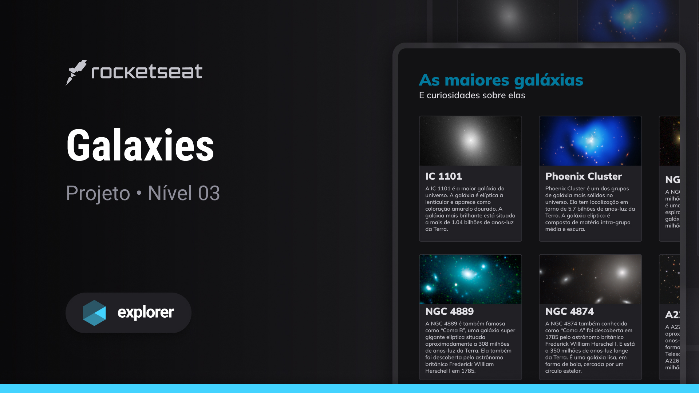

## 💻 Projeto

Esse é um projeto Web com Grid de cards sobre Galáxias.

## 🚀 Tecnologias

Esse projeto foi desenvolvido durante o curso Explorer da Rocketseat com as seguintes tecnologias:

- HTML
- CSS

## 🏷️ Layout

Você pode visualizar o layout do projeto através [desse link](https://www.figma.com/community/file/1256354736253234634).
É necessário ter uma conta do [Figma](https://www.figma.com).
